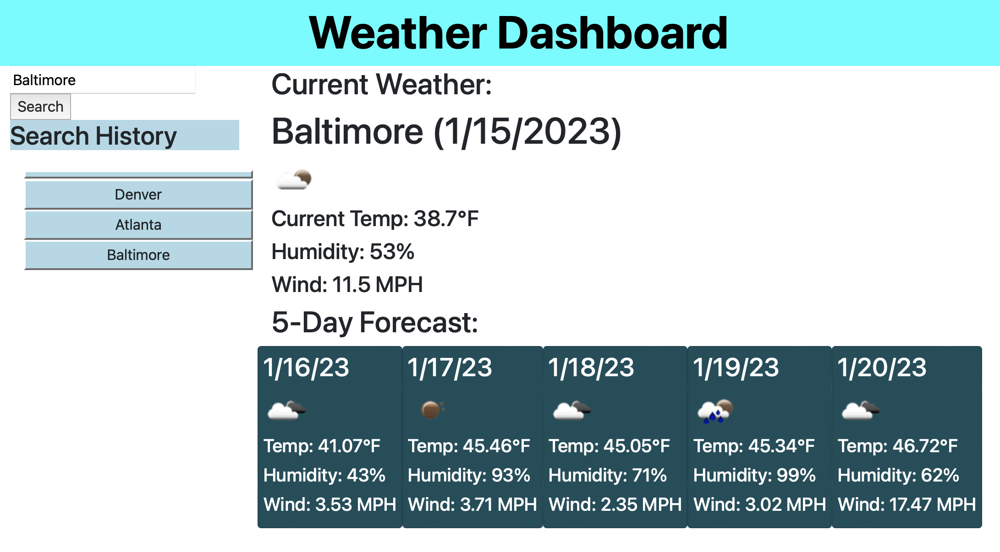

# Weather Dashboard

This is a **weather forecast app** that displays a 5-day weather forecast.

## Table of Contents

- [Background](#background)
- [Install](#install)
- [Usage](#usage)
- [Screenshot](#screenshot)
- [Maintainers](#maintainers)
- [Contributing](#contributing)
- [Contributors](#contributors)
- [License](#license)

## Background

*To use our skills in API calls,* we were instructed to create a weather dashboard, including a current weather display and the 5-day forecast. Also included is a search history that recalls cities that were already searched for.

## Install/Link to Webpage 🔗 

Check out the link to the website:

https://dbedrossian.github.io/Mod6_Weather-Dashboard/

## Usage

This is being used as an assignment project, but could easily be used in real life for any kind of weather search app.

## Screenshot

## Maintainers

[@Danny Bedrossian](https://github.com/dbedrossian).

## Contributing

Feel free to dive in! [Open an issue](https://github.com/dbedrossian/standard-readme/issues/new) or submit PRs.

## Contributors

Special thanks to the help of tutor Sachin Jhaveri.

## License

© Danny Bedrossian